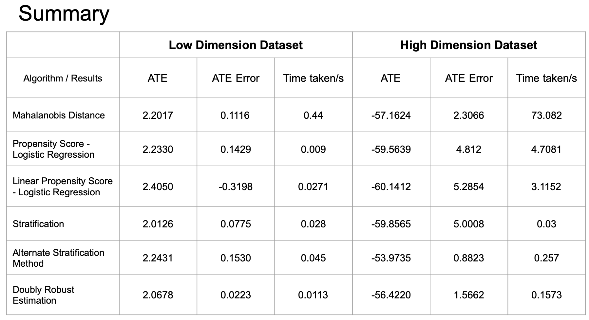

```{r setup, include=FALSE}
knitr::opts_chunk$set(echo = TRUE)
```

## Setting up environment

```{r echo=FALSE, results = FALSE, include=FALSE}
if(!require(MatchIt)) install.packages("MatchIt", repos = "http://cran.us.r-project.org")
if(!require(dplyr)) install.packages("dplyr", repos = "http://cran.us.r-project.org")
if(!require(ggplot2)) install.packages("ggplot2", repos = "http://cran.us.r-project.org")
if(!require(lmtest)) install.packages("lmtest", repos = "http://cran.us.r-project.org")
if(!require(sandwich)) install.packages("sandwich", repos = "http://cran.us.r-project.org")
if(!require(optmatch)) install.packages("optmatch", repos = "http://cran.us.r-project.org")
if(!require(broom)) install.packages("broom", repos = "http://cran.us.r-project.org")

library(MatchIt)
library(dplyr)
library(ggplot2)
library(lmtest) 
library(sandwich) 
library(optmatch)
library(broom)
```

## Pre-Analysis
```{r Difference in Means Pre-Analysis, echo=FALSE, warning=FALSE}
# Reading in the datasets as R Dataframes
highDim_data = read.csv("../data/highDim_dataset.csv")
lowDim_data = read.csv("../data/lowDim_dataset.csv")

highDim_data %>% 
  group_by(A) %>% 
  summarise(n=n(),
            mean_outcome=mean(Y),
            std_error = sd(Y) / sqrt(n), .groups = "drop")

with(highDim_data, t.test(Y ~ A))

lowDim_data %>% 
  group_by(A) %>% 
  summarise(n=n(),
            mean_outcome=mean(Y),
            std_error = sd(Y) / sqrt(n), .groups = "drop")

with(lowDim_data, t.test(Y ~ A))

true_low_ATE<-2.0901
true_high_ATE<- -54.8558
```
# Causal Inference Methods

## Pairing 1
>Algorithm: `Propensity Matching`
>Distance Measure: `Mahalanobis`
>Propensity Score Estimation: `NA`

### Introduction of the algorithm

```{r ATE(average treatment effect), running time of pairing 1, echo=FALSE}
mahalanobis.ate <- function(data){
  varnum=dim(data)[2]-2
  xnam <- paste0("V", 1:varnum)
  start_time <- Sys.time()
  match_full<-matchit(as.formula(paste("A ~ ", paste(xnam, collapse= "+"))),data=data,method="full", distance="mahalanobis",
                    link = "logit", estimand = "ATE")
  data.fullMatching <- match.data(match_full)
  x = data.fullMatching %>% group_by(subclass,A) %>% summarise(mean_y = mean(Y), .groups = 'drop')
  group_ate = x %>% group_by(subclass) %>% summarise(treat_eff = mean_y[A == 1] - mean_y[A == 0], .groups = 'drop')
  group_n = data.fullMatching %>% group_by(subclass) %>% count()
  ate = sum(group_ate$treat_eff*group_n$n/nrow(data))
  end_time <- Sys.time()
  return(list(ATE=ate,running_time = end_time - start_time))
}
```

#### Use Logistic regression to get the propensity score
```{r Propensity Score Estimation, echo=FALSE, warning=FALSE}
# High dimension dataset
ps_hd_est <- glm(A ~ . -Y,
                 family=binomial(), 
                 data=highDim_data)

ps_hd_df <- data.frame(prop_score = predict(ps_hd_est, type = "response"),
                       treatment = ps_hd_est$model$A,
                       Y = ps_hd_est$model$Y)
ps_hd_df %>%
  group_by(treatment) %>% 
  summarise(mean_prop_score=mean(prop_score), .groups = "drop")
  
labs <- paste("Actual treatment indicator:", c("Treated", "Control"))
ps_hd_df %>%
  mutate(treatment = ifelse(treatment == 1, labs[1], labs[2])) %>%
  ggplot(aes(x = prop_score), binwidth = 30) +
  geom_histogram(color = "white", bins=30) +
  facet_wrap(~treatment) +
  xlab("Probability of being exposed") +
  theme_bw()

# Low dimension dataset
ps_ld_est <- glm(A ~ . -Y,
                 family=binomial(), 
                 data=lowDim_data)

ps_ld_df <- data.frame(prop_score = predict(ps_ld_est, type = "response"),
                       treatment = ps_ld_est$model$A,
                       Y = ps_ld_est$model$Y)
ps_ld_df %>%
  group_by(treatment) %>% 
  summarise(mean_prop_score=mean(prop_score), .groups = "drop")
  
labs <- paste("Actual treatment indicator:", c("Treated", "Control"))
ps_ld_df %>%
  mutate(treatment = ifelse(treatment == 1, labs[1], labs[2])) %>%
  ggplot(aes(x = prop_score)) +
  geom_histogram(color = "white", bins=30) +
  facet_wrap(~treatment) +
  xlab("Probability of being exposed") +
  theme_bw()
```

```{r Pairing 1 Implementing Matching Low Dim, echo=FALSE}
# Algorithm: Propensity Matching
# Distance Measure: Mahalanobis
# Propensity Score Estimation: NA
# Matching performed on low dimension dataset
covs = colnames(lowDim_data)[-2:-1]
pair1_lowdim_time = system.time({
  if (length(na.omit(lowDim_data)) != length(lowDim_data)) {
    print('There are null values in the dataset')
    break
    } else {
    pair_1 <- matchit(A ~ V1 + V2 + V3 + V4 + V5 + V6 + V7 + V8 + V9 + V10 + V11 + V12 + V13 + V14 + V15 + V16 + V17 + V18 + V19 + V20 + V21 + V22,
                      data=lowDim_data,
                      method="full",
                      distance="mahalanobis",
                      estimand = "ATE")
  }  
})
```

```{r Assessing Quality of Pairing 1 Matches Low Dim, echo=FALSE}
#pair_1
#summary(pair_1, un = FALSE)
# Unable to plot for Mahalanobis as there is no propensity score calculcated for this distance measure
# plot(pair_1, type = "jitter", interactive = FALSE)
```
```{r Preparing Data Frame based on Pairing 1 Matches Low Dim, echo=FALSE}
mpair_1 = match.data(pair_1)
#head(mpair_1)
```
```{r Estimating Treatment Effects using Pairing 1 Matches Low Dim, echo=FALSE}
mpair1_fit <- lm(Y ~ . -Y -weights -subclass,
                 data = mpair_1,
                 weights = weights)

pair1_lowdim_ATE = mpair1_fit$coefficients['A']
#coeftest(mpair1_fit, vcov. = vcovCL, cluster = ~subclass)
```

### method 2
```{r ATE(average treatment effect), running time of pairing 1, echo=FALSE}
mahalanobis.ate <- function(data){
  varnum=dim(data)[2]-2
  xnam <- paste0("V", 1:varnum)
  start_time <- Sys.time()
  match_full<-matchit(as.formula(paste("A ~ ", paste(xnam, collapse= "+"))),data=data,method="full", distance="mahalanobis",
                    link = "logit", estimand = "ATE")
  data.fullMatching <- match.data(match_full)
  x = data.fullMatching %>% group_by(subclass,A) %>% summarise(mean_y = mean(Y), .groups = 'drop')
  group_ate = x %>% group_by(subclass) %>% summarise(treat_eff = mean_y[A == 1] - mean_y[A == 0], .groups = 'drop')
  group_n = data.fullMatching %>% group_by(subclass) %>% count()
  ate = sum(group_ate$treat_eff*group_n$n/nrow(data))
  end_time <- Sys.time()
  return(list(ATE=ate,running_time = end_time - start_time))
}
```

#### High Dim data
```{r highDim for pairing 1, echo=FALSE}
pair1high = mahalanobis.ate(highDim_data)

cat("ATE for high dimensional data is:", pair1high$ATE, ".\n")
cat("Processing time for high dimensional data is" , pair1high$running_time, "seconds.\n")
cat("ATE error for high dimensional data is:", true_high_ATE-pair1high$ATE, ".\n")
```

#### Low Dim data
```{r lowDim for pairing 1, echo=FALSE}
pair1low = mahalanobis.ate(lowDim_data)

cat("ATE for low dimensional data is:", pair1low$ATE, ".\n")
cat("Processing time for low dimensional data is" ,pair1low$running_time, "seconds.\n")
cat("ATE error for low dimensional data is:", true_low_ATE-pair1low$ATE, ".\n")
```

***

## Pairing 2
>Algorithm: `Propensity Matching`
>Distance Measure: `Propensity Score`
>Propensity Score Estimation: `Logistic Regression`

### Introduction of the algorithm


```{r ATE(average treatment effect), running time of pairing 2, echo=FALSE}
Propensity.Score.ate <- function(data, methods, link){
  start_time <- Sys.time()
  match_full<-matchit(A ~ .-Y,data=data,method=methods,distance="glm",link = link, estimand = "ATE")
  data.fullMatching <- match.data(match_full)
  x = data.fullMatching %>% group_by(subclass,A) %>% summarise(mean_y = mean(Y), .groups = 'drop')
  group_ate = x %>% group_by(subclass) %>% summarise(treat_eff = mean_y[A == 1] - mean_y[A == 0], .groups = 'drop')
  group_n = data.fullMatching %>% group_by(subclass) %>% count()
  ate = sum(group_ate$treat_eff*group_n$n/nrow(data))
  end_time <- Sys.time()
  return(list(ATE=ate,running_time = end_time - start_time))
}
```

### optimal full matching
#### High Dim data
```{r highDim for pairing 2 full, echo=FALSE}
pair2fhigh = Propensity.Score.ate(highDim_data, methods="full", link="logit")

cat("ATE for high dimensional data is:", pair2fhigh$ATE, ".\n")
cat("Processing time for high dimensional data is" ,pair2fhigh$running_time, "seconds.\n")
cat("ATE error for high dimensional data is:", true_high_ATE-pair2fhigh$ATE, ".\n")
```

#### Low Dim data
```{r lowDim for pairing 2 full, echo=FALSE}
pair2flow = Propensity.Score.ate(lowDim_data, methods="full", link="logit")

cat("ATE for low dimensional data is:", pair2flow$ATE, ".\n")
cat("Processing time for low dimensional data is" ,pair2flow$running_time, "seconds.\n")
cat("ATE error for low dimensional data is:", true_low_ATE-pair2flow$ATE, ".\n")
```

### subclassification
#### High Dim data
```{r highDim for pairing 2 sub, echo=FALSE}
pair2shigh = Propensity.Score.ate(highDim_data, methods="subclass", link="logit")

cat("ATE for high dimensional data is:", pair2shigh$ATE, ".\n")
cat("Processing time for high dimensional data is" ,pair2shigh$running_time, "seconds.\n")
cat("ATE error for high dimensional data is:", true_high_ATE-pair2shigh$ATE, ".\n")
```

#### Low Dim data
```{r lowDim for pairing 2 sub, echo=FALSE}
pair2slow = Propensity.Score.ate(lowDim_data, methods="subclass", link="logit")

cat("ATE for low dimensional data is:", pair2slow$ATE, ".\n")
cat("Processing time for low dimensional data is" ,pair2slow$running_time, "seconds.\n")
cat("ATE error for low dimensional data is:", true_low_ATE-pair2slow$ATE, ".\n")
```


***

## Pairing 5
>Algorithm: `Propensity Matching`
>Distance Measure: `Linear Propensity Score`
>Propensity Score Estimation: `Logistic Regression`

### Introduction of the algorithm
The distance of Propensity Score is defined as:
$D_{ij}=|e_i-e_j|$
Obtained by applying the logit function on the Propensity Scores.
Matching on the linear propensity score can be particularly effective in terms of reducing bias.

Linear propensity score matching is same with propensity score to entail forming matched sets of treated and untreated subjects who share a similar value of the propensity score. Once a matched sample has been formed, the treatment effect can be estimated by directly comparing outcomes between treated and untreated subjects in the matched sample. Once the effect of treatment has been estimated in the propensity score matched sample, the variance of the estimated treatment effect and its statistical significance can be estimated. 

After the matched sets are obtained, Linear Propensity Score asks to calculate a “subclass effects” for each matched set/subclass, and then estimate overall ATE by an weighted average of the subclass effects where weights would be the number of individuals in each subclass.


Linear Propensity score performed well for low dimensional dataset as explained above for standard propensity score.

Linear Propensity Score didn't perform as well for high dimension as low dimensional dataset for the same reason discussed above for standard Propensity Score.

### optimal full matching
```{r ATE(average treatment effect), running time of pairing 5, echo=FALSE}
pair5fhigh = Propensity.Score.ate(highDim_data, methods="full", link="linear.logit")
pair5flow = Propensity.Score.ate(lowDim_data, methods="full", link="linear.logit")
```

#### High Dim data
```{r highDim data, echo=FALSE}
cat("ATE for high dimensional data is:", pair5fhigh$ATE, ".\n")
cat("Processing time for high dimensional data is" ,pair5fhigh$running_time, "seconds.\n")
cat("ATE error for high dimensional data is:", true_high_ATE-pair5fhigh$ATE, ".\n")
```

#### Low Dim data
```{r lowDim data, echo=FALSE}
cat("ATE for low dimensional data is:", pair5flow$ATE, ".\n")
cat("Processing time for low dimensional data is" ,pair5flow$running_time, "seconds.\n")
cat("ATE error for low dimensional data is:", true_low_ATE-pair5flow$ATE, ".\n")
```

### subclassification
```{r subclass, running time of pairing 5, echo=FALSE}
pair5shigh = Propensity.Score.ate(highDim_data, methods="subclass", link="linear.logit")
pair5slow = Propensity.Score.ate(lowDim_data, methods="subclass", link="linear.logit")
```

#### High Dim data
```{r highDim data for subclass, echo=FALSE}
cat("ATE for high dimensional data is:", pair5shigh$ATE, ".\n")
cat("Processing time for high dimensional data is" ,pair5shigh$running_time, "seconds.\n")
cat("ATE error for high dimensional data is:", true_high_ATE-pair5shigh$ATE, ".\n")
```

#### Low Dim data
```{r lowDim data for subclass, echo=FALSE}
cat("ATE for low dimensional data is:", pair5slow$ATE, ".\n")
cat("Processing time for low dimensional data is" ,pair5slow$running_time, "seconds.\n")
cat("ATE error for low dimensional data is:", true_low_ATE-pair5slow$ATE, ".\n")
```

***

## Pairing 12
>Algorithm: `Doubly Robust Estimation`
>Distance Measure: `Propensity Score`
>Propensity Score Estimation: `Logistic Regression`

### Introduction of the algorithm

* The Doubly Robust Estimation has the smallest asymptotic variance. It remains consistent if the outcome models are wrong but the propensity model is right, or if the propensity model is wrong but the outcome models are right.

* Doubly Robust Estimator formula:
$$\hat{\Delta_{DR}} = N^{-1}\sum_{i=1}^{N} \frac{T_iY_i-(T_i-\hat{e_i}) \hat{m_1}(X_i)}{\hat{e_i}} - N^{-1}\sum_{i=1}^{N} \frac{(1-T_i)Y_i-(T_i-\hat{e_i}) \hat{m_0}(X_i)}{1-\hat{e_i}}$$

where $\hat{e_i}$ is the estimated propensity score for individual $i$, $\hat{m_t}(X)$ is a consistent estimate for $E(Y|T=t,X)$ and is usually obtained by regressing the observed response Y on X in group t.


```{r doubly robust estimation, echo=FALSE}
DoublyRobustEst <- function(data) {
  
  X = data %>% select(-Y, -A)
  n <- dim(data)[1]
  
  #get propensity scores by using logistic regression
  logit_model <- glm(A ~., data=data[,-1], family="binomial")
  propensity <- predict(logit_model, X, type="response")
  data$ps <- propensity
  
  start_time <- Sys.time()
  #split treatment and control group, and do regression for each group
  control <- data[data$A == 0, -2]
  treatment <- data[data$A == 1, -2]

  control_model <- lm(Y ~., data=control)
  treatment_model <- lm(Y ~., data=treatment)
  
  data$m0 <- predict(control_model, data[,-c(1,2)])
  data$m1 <- predict(treatment_model, data[,-c(1,2)])
  
  #calculate ATE
  ATE <- sum((data$A*data$Y-(data$A-data$ps)*data$m1)/data$ps)/n - 
         sum(((1-data$A)*data$Y+(data$A-data$ps)*data$m0)/(1-data$ps))/n
  
  end_time <- Sys.time()
  time <- end_time - start_time
  
  df <- data.frame(cbind(ATE,time))
  
  return(df)
}

```

#### highDim data

```{r highDim data for pairing 12, echo=FALSE}
DRE.high <- DoublyRobustEst(highDim_data)
diff.high <- true_high_ATE-DRE.high[,1]

cat("ATE for high dimensional data is:", DRE.high[,1], ".\n")
cat("Processing time for high dimensional data is" ,DRE.high[,2], "seconds.\n")
cat("ATE error for high dimensional data is:", diff.high, ".\n")
``` 

#### lowDim data

```{r lowDim data for pairing 12, echo=FALSE}
DRE.low <- DoublyRobustEst(lowDim_data)
true.ATE.low <- 2.0901
diff.low <- true_low_ATE-DRE.low[,1]

cat("ATE for low dimensional data is:", DRE.low[,1], ".\n")
cat("Processing time for low dimensional data is" ,DRE.low[,2], "seconds.\n")
cat("ATE error for low dimensional data is:", diff.low, ".\n")
```

***

## Pairing 16
>Algorithm: `Stratification`
>Distance Measure: `Propensity Score`
>Propensity Score Estimation: `Logistic Regression`

### Introduction of the algorithm
#### Perform stratification and find difference of means and weights.
```{r, echo=FALSE, warning=FALSE}


n_strat <- 7
#High Dimensional Data
hd_prep <- system.time({
  
  #Stratify the Data by Propensity score
  hd_strat_divider <- n_strat/nrow(ps_hd_df);
  strat_hd_df <- ps_hd_df %>% arrange(prop_score) %>%
    mutate(stratum =  as.integer((1:n() -.5)*hd_strat_divider ) + 1);
  
  #Differences in means
  diff_mean_hd <- strat_hd_df %>%
    group_by(treatment, stratum) %>%
    summarise(mean_treat = mean(Y), .groups = "keep") %>%
    mutate(mean_treat= if_else(treatment == 0, -mean_treat, mean_treat)) %>%
    ungroup(treatment) %>%
    mutate(diff_mean = sum(mean_treat)) %>%
    filter(treatment == 0) %>%
    select(stratum, diff_mean);
  #Weights for each stratum
  diff_weight_hd <- strat_hd_df %>%
    group_by(stratum) %>%
    tally() %>%
    mutate(weight = n/nrow(strat_hd_df)) %>%
    left_join(diff_mean_hd, by = "stratum") %>%
    select(weight, diff_mean);
  
  #Calculate the ATE
  ATE_hd <- sum(diff_weight_hd$diff_mean * diff_weight_hd$weight)
})
time_hd <-sum(hd_prep)
#Low Dimensional Data
ld_prep <- system.time({
  
  #Stratify the Data by Propensity score
  ld_strat_divider <- n_strat/nrow(ps_ld_df);
  strat_ld_df <- ps_ld_df %>% arrange(prop_score) %>%
    mutate(stratum =  as.integer((1:n() -.5)*ld_strat_divider ) + 1);
  #Differences in means
  diff_mean_ld <- strat_ld_df %>%
    group_by(treatment, stratum) %>%
    summarise(mean_treat = mean(Y), .groups = "keep") %>%
    mutate(mean_treat= if_else(treatment == 0, -mean_treat, mean_treat)) %>%
    ungroup(treatment) %>%
    mutate(diff_mean = sum(mean_treat)) %>%
    filter(treatment == 0) %>%
    select(stratum, diff_mean);
  #Weights for each stratum
  diff_weight_ld <- strat_ld_df %>%
    group_by(stratum) %>%
    tally() %>%
    mutate(weight = n/nrow(strat_ld_df)) %>%
    left_join(diff_mean_ld, by = "stratum") %>%
    select(weight, diff_mean);
  
  #Calculate the ATE
  ATE_ld <- sum(diff_weight_ld$diff_mean * diff_weight_ld$weight)
}) 
time_ld <- sum(ld_prep)
```

#### Alternate Method that performs regression on each stratum by Y with A and Vs. Then averages the coefficients 
### for A in each stratum to get the ATE

```{r, echo=FALSE}
n_strat <- 7
#High Dimensional Data
hd_prep_alt <- system.time({
  hd_strat_divider <- n_strat/nrow(ps_hd_df);
  
  #Append propensity score to the initial dataset
  hd_pscore <- matrix(ps_hd_df$prop_score, ncol = 1);
  hd_df_pscore <- cbind(highDim_data, hd_pscore);
  
  strat_hd_df_alt <- hd_df_pscore %>% arrange(hd_pscore) %>%
    mutate(stratum =  as.integer((1:n() -.5)*hd_strat_divider ) + 1) %>%
    select(-hd_pscore);
  
  strat_hd_reg <- strat_hd_df_alt %>% group_by(stratum) %>%
    do(strat_reg = lm(Y ~ A + .-stratum, data = .)) %>%
    mutate(coefs = list(strat_reg[["coefficients"]])) %>%
    select(-strat_reg) %>%
    summarize(ajz = coefs[["A"]], .groups = "drop");
 
  #Calculate the ATE
  ATE_hd_alt <-  mean(strat_hd_reg$ajz)
  
})
time_hd_alt <- sum(hd_prep_alt)
#Low Dimensional Data
ld_prep_alt <- system.time({
  
  ld_strat_divider <- n_strat/nrow(ps_ld_df);
  
  #Append propensity score to the initial dataset
  ld_pscore <- matrix(ps_ld_df$prop_score, ncol = 1);
  ld_df_pscore <- cbind(lowDim_data, ld_pscore);
  
  strat_ld_df_alt <- ld_df_pscore %>% arrange(ld_pscore) %>%
    mutate(stratum =  as.integer((1:n() -.5)*ld_strat_divider ) + 1) %>%
    select(-ld_pscore);
  
  strat_ld_reg <- strat_ld_df_alt %>% group_by(stratum) %>%
    do(strat_reg = lm(Y ~ A + .-stratum, data = .)) %>%
    mutate(coefs = list(strat_reg[["coefficients"]])) %>%
    select(-strat_reg) %>%
    summarize(ajz = coefs[["A"]], .groups = "drop")
  #Calculate the ATE
  ATE_ld_alt <-  mean(strat_ld_reg$ajz)
  
}) 
time_ld_alt <- sum(ld_prep_alt)
```


### Calculates the ATE and process time
#### High Dim data
```{r highDim for pairing 12, echo=FALSE}
cat("ATE for stratification is:", ATE_hd, ".\n")
cat("Processing time for stratification is" , time_hd, "seconds.\n")
cat("ATE error for stratification is:", true_high_ATE-ATE_hd, ".\n")
cat("\nATE for stratification alternative is:", ATE_hd_alt, ".\n")
cat("Processing time for stratification is" , time_hd_alt, "seconds.\n")
cat("ATE error for stratification alternative is:", true_high_ATE-ATE_hd_alt, ".\n")
```

#### Low Dim data
```{r lowDim for pairing 12, echo=FALSE}
cat("ATE for stratification is:", ATE_ld, ".\n")
cat("Processing time for stratification is" , time_ld, "seconds.\n")
cat("ATE error for stratification is:", true_low_ATE-ATE_ld, ".\n")
cat("\nATE for stratification alternative is:", ATE_ld_alt, ".\n")
cat("Processing time for stratification is" , time_ld_alt, "seconds.\n")
cat("ATE error for stratification alternative is:", true_low_ATE-ATE_ld_alt, ".\n")
```

## Summary


Based on our calculation on ATE and processing time for the five algorithms that we implemented, we conclude that stratification works best on low dimension dataset and the stratification with alternative method is the most efficient on high dimension dataset.